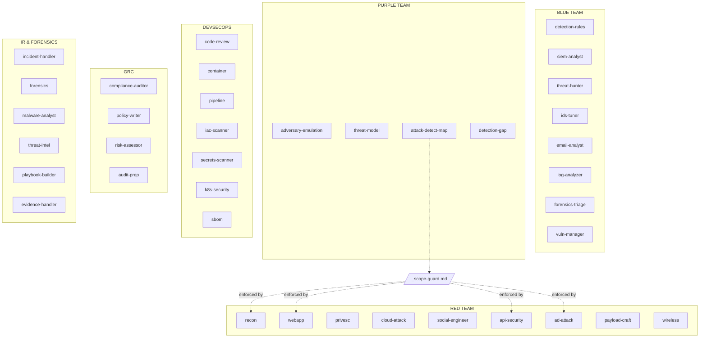

<p align="center">
  
  
  
  
</p>

<h1 align="center">claude-security-agents</h1>

<p align="center">
  <strong>38 specialized Claude Code sub-agents for full-stack cybersecurity.</strong><br/>
  Blue Team · Red Team · Purple Team · DevSecOps · GRC · Incident Response
</p>

<p align="center">
  Zero dependencies. Just Markdown files.<br/>
  Describe a security task in natural language — the right agent handles it.
</p>

---

## How it works

```
You: "Write a Sigma rule for detecting DCSync attacks"
  └─→ Claude routes to: blue-detection-rules
      └─→ Produces: Sigma YAML with ATT&CK T1003.006 mapping, SPL translation, FP guidance

You: "Audit this Dockerfile for security issues"  
  └─→ Claude routes to: devsecops-container
      └─→ Produces: CIS Docker Benchmark findings with remediated snippets

You: "Map T1059.001 — show me the attack AND the detection"
  └─→ Claude routes to: purple-attack-detect-map
      └─→ Produces: Dual attack/detect document with procedures and Sigma rules
```

No configuration. No API keys. No external tools required. Install the agents, open Claude Code, and go.

---

## Quick Start

```bash
# One-line install (all 38 agents)
curl -fsSL https://raw.githubusercontent.com/AbrahamOP/claude-security-agents/main/install.sh | bash

# Or clone first
git clone https://github.com/AbrahamOP/claude-security-agents.git
cd claude-security-agents
./install.sh --global
```

**Options:**
```bash
./install.sh --category blue,ir    # Install specific categories only
./install.sh --project             # Install in current project (not global)
./install.sh --lite                # Use Claude Haiku (cheaper) for advisory agents
./install.sh --uninstall           # Clean removal
./install.sh --status              # Show what's installed
```

---

## Agent Map



---

## All Agents

### Blue Team — Defend and Detect

| Agent | Tier | What it does |
|:------|:----:|:-------------|
| `blue-detection-rules` | T2 | Writes Sigma, SPL, KQL, and YARA rules with ATT&CK mapping and FP tuning |
| `blue-siem-analyst` | T1 | Triages SIEM alerts, builds correlation logic, optimizes queries |
| `blue-threat-hunter` | T2 | Runs hypothesis-driven threat hunts with ATT&CK playbooks |
| `blue-ids-tuner` | T2 | Writes and tunes Suricata/Snort rules, manages false positives |
| `blue-email-analyst` | T1 | Analyzes email headers, SPF/DKIM/DMARC, delivers phishing verdicts |
| `blue-log-analyzer` | T1 | Parses and correlates security events across log formats |
| `blue-forensics-triage` | T2 | First-responder live triage — volatile data collection and preservation |
| `blue-vuln-manager` | T1 | Vulnerability lifecycle — triage, EPSS/KEV prioritization, SLA tracking |

### Red Team — Attack and Exploit

| Agent | Tier | What it does |
|:------|:----:|:-------------|
| `red-recon` | T2 | Passive/active recon — subdomains, ports, tech stack, attack surface |
| `red-webapp` | T2 | OWASP Top 10 testing — injection, auth bypass, business logic |
| `red-api-security` | T2 | API pentesting — REST, GraphQL, IDOR, broken auth, rate limiting |
| `red-ad-attack` | T2 | Active Directory — Kerberoast, BloodHound, lateral movement, domain admin |
| `red-privesc` | T1 | Linux/Windows privilege escalation path analysis and advisory |
| `red-cloud-attack` | T1 | Cloud attack paths — IAM escalation, metadata abuse (AWS/Azure/GCP) |
| `red-social-engineer` | T1 | Phishing campaign design, pretexts, vishing scripts, awareness testing |
| `red-payload-craft` | T1 | Payload crafting advisory — msfvenom, encoding, evasion techniques |
| `red-wireless` | T1 | WiFi/BLE security assessment — WPA cracking, rogue AP, handshake analysis |

### Purple Team — Bridge Attack and Defense

| Agent | Tier | What it does |
|:------|:----:|:-------------|
| `purple-adversary-emulation` | T1 | Plans ATT&CK-mapped adversary emulation exercises |
| `purple-threat-model` | T1 | STRIDE/PASTA threat modeling with risk-rated scenarios |
| `purple-attack-detect-map` | T2 | **Unique** — produces attack procedure AND detection rule side by side |
| `purple-detection-gap` | T1 | Assesses ATT&CK detection coverage and identifies blind spots |

### DevSecOps — Shift Left

| Agent | Tier | What it does |
|:------|:----:|:-------------|
| `devsecops-code-review` | T1 | Security code review — injection, auth, secrets, CWE/OWASP mapping |
| `devsecops-container` | T2 | Dockerfile/compose hardening with CIS Docker Benchmark |
| `devsecops-pipeline` | T1 | CI/CD security audit — GitHub Actions, GitLab CI, SLSA alignment |
| `devsecops-iac-scanner` | T2 | Terraform/CloudFormation/K8s manifest misconfiguration detection |
| `devsecops-secrets-scanner` | T2 | Detects leaked secrets in code, git history, and config files |
| `devsecops-k8s-security` | T2 | Kubernetes RBAC, pod security, network policies, CIS K8s Benchmark |
| `devsecops-sbom` | T2 | SBOM generation, dependency CVE scanning, license compliance, supply chain risk |

### GRC & Compliance — Govern and Certify

| Agent | Tier | What it does |
|:------|:----:|:-------------|
| `grc-compliance-auditor` | T1 | Gap analysis — CIS, NIST 800-53, ISO 27001, SOC 2, PCI-DSS, NIS2 |
| `grc-policy-writer` | T2 | Drafts security policies — IR plan, AUP, access control, BCP/DRP |
| `grc-risk-assessor` | T1 | Risk assessment — ISO 27005, NIST 800-30, FAIR, EBIOS RM |
| `grc-audit-prep` | T1 | Audit readiness — evidence mapping, gap prioritization, interview prep |

### IR & Forensics — Respond and Investigate

| Agent | Tier | What it does |
|:------|:----:|:-------------|
| `ir-incident-handler` | T2 | NIST SP 800-61 incident coordination — triage through lessons learned |
| `ir-forensics` | T1 | Digital forensics advisory — disk, memory, network evidence analysis |
| `ir-malware-analyst` | T1 | Static/dynamic malware analysis, IOC extraction, YARA generation |
| `ir-threat-intel` | T2 | IOC enrichment, campaign correlation, Diamond Model TI reports |
| `ir-playbook-builder` | T2 | Builds structured IR playbooks with decision trees and metrics |
| `ir-evidence-handler` | T1 | Chain of custody, forensic imaging, evidence preservation (RFC 3227/ISO 27037) |

---

## Tier System

| | Tier 1 — Advisory | Tier 2 — Execution |
|---|---|---|
| **Executes commands** | No | Yes (with user approval) |
| **Writes files** | No | Yes |
| **Scope required** | No | Yes (offensive agents) |
| **Risk level** | None | Controlled |
| **Best for** | Analysis, guidance, reports | Scanning, testing, rule writing |

All Tier 2 offensive agents enforce the [Scope Guard](agents/_scope-guard.md) — mandatory target declaration, hard refusal list, and OPSEC tagging (PASSIVE/LIGHT/ACTIVE/LOUD).

---

## Customization

**Change model** — edit any agent's frontmatter:
```yaml
model: haiku    # cheaper, good for Tier 1 advisory
model: sonnet   # default, balanced
model: opus     # most capable, complex analysis
```

**Add context** — append your environment details (SIEM platform, cloud provider, compliance scope) to any agent's body.

**Fork and extend** — each agent is a standalone file. Add your own, modify existing ones, submit a PR.

---

## Examples

<details>
<summary><strong>Blue Team examples</strong></summary>

```
"Write a Sigma rule for detecting Kerberoasting via Event ID 4769"
"Triage this Wazuh alert — rule 5712, brute force from 185.220.101.x"
"Hunt for living-off-the-land binaries in these Windows event logs"
"Analyze this email — From says paypal.com but Return-Path is different"
"Parse these Apache access logs and find suspicious patterns"
```
</details>

<details>
<summary><strong>Red Team examples</strong></summary>

```
"Enumerate the attack surface for target.example.com"
"Test this login form for SQL injection and auth bypass"
"I have a shell as www-data on Ubuntu 22.04, what are my privesc options?"
"Enumerate this AD environment — find a path to Domain Admin"
"Test this GraphQL API for IDOR and broken authorization"
```
</details>

<details>
<summary><strong>Purple Team examples</strong></summary>

```
"Map T1059.001 (PowerShell) — show me both attack and detection"
"Plan an adversary emulation exercise based on APT29 TTPs"
"Threat model this microservices architecture with public API"
"Assess our ATT&CK detection coverage and identify the top 10 gaps"
```
</details>

<details>
<summary><strong>DevSecOps examples</strong></summary>

```
"Review this Python Flask app for security vulnerabilities"
"Audit this Dockerfile and docker-compose.yml"
"Check this GitHub Actions workflow for security risks"
"Scan this Terraform config for AWS misconfigurations"
"Search this repo's git history for leaked secrets"
"Audit this Kubernetes deployment for pod security issues"
```
</details>

<details>
<summary><strong>GRC examples</strong></summary>

```
"Map our controls against NIST 800-53 and identify gaps"
"Draft an incident response policy for a SaaS company"
"Run a risk assessment on our cloud infrastructure"
"Prepare us for the upcoming SOC 2 Type II audit"
```
</details>

<details>
<summary><strong>IR & Forensics examples</strong></summary>

```
"Coordinate the response — lateral movement detected from workstation"
"Walk me through analyzing this suspicious PE binary"
"Enrich these IOCs: 185.220.101.42, evil.xyz, SHA256:a1b2c3..."
"Build an IR playbook for ransomware incidents"
"Triage this live system — collect volatile data before imaging"
```
</details>

---

## Requirements

- [Claude Code](https://claude.ai/code) CLI, Desktop, or Web
- Claude API access (Sonnet recommended, Haiku works for Tier 1)
- That's it. No other dependencies.

---

## Contributing

PRs welcome — see [CONTRIBUTING.md](.github/CONTRIBUTING.md) for the agent format spec.

## Disclaimer

Authorized security testing only — see [DISCLAIMER.md](DISCLAIMER.md).

## License

[MIT](LICENSE)
